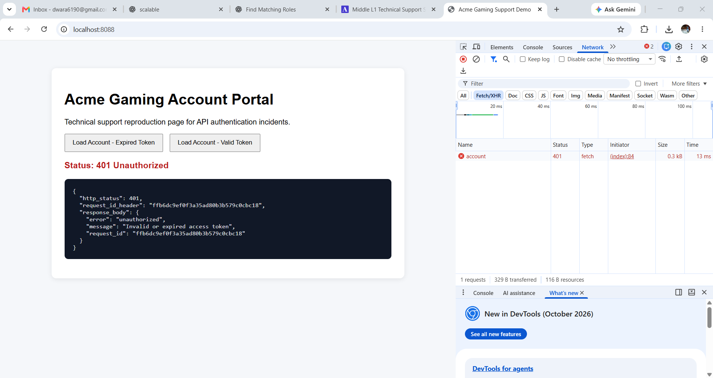
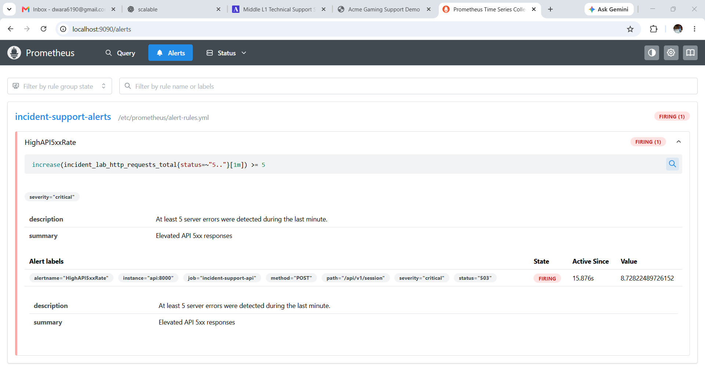
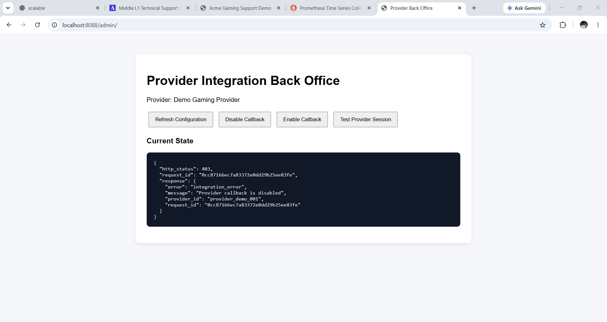
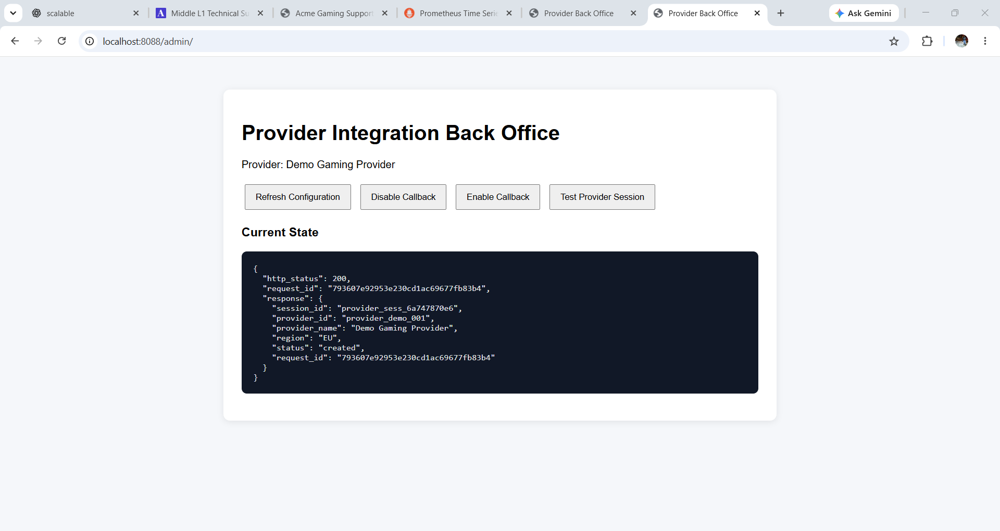
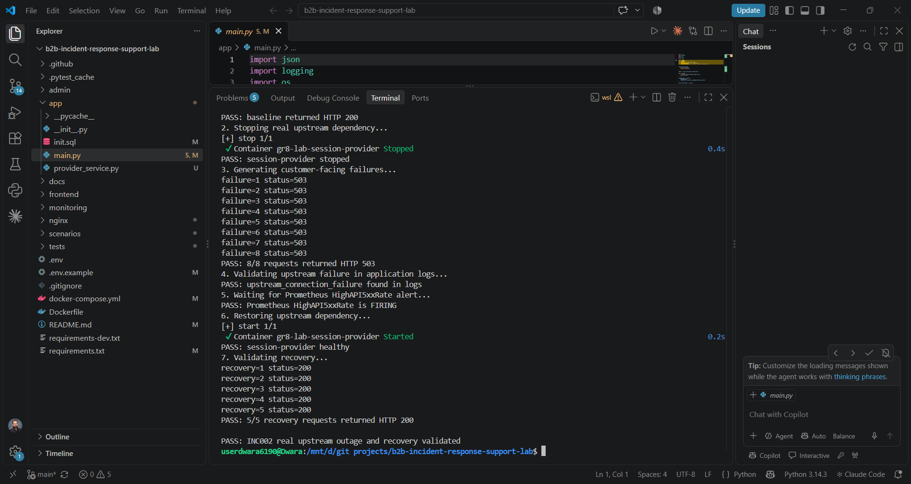

# B2B Incident Response Support Lab

A hands-on Technical Support and Application Support engineering lab focused on B2B incident investigation, Browser DevTools, server logs, monitoring, SLA-driven incident response, administrative back-office troubleshooting, L1-to-L2/L3 escalation, and customer communication.

The lab models support workflows found in high-availability SaaS and digital platforms.

## Skills Demonstrated

- B2B Technical Support
- Application Support
- Ticket ownership and root-cause investigation
- Browser DevTools
- HTTP request/response troubleshooting
- REST APIs
- Request ID correlation
- Server log analysis
- Prometheus monitoring and alerting
- Critical incident coordination
- Severity classification
- SLA-aware client communication
- L1 to L2/L3 engineering escalation
- Administrative back-office troubleshooting
- PostgreSQL validation
- Docker and Nginx
- Python / FastAPI
- Automated integration testing

## Architecture

    Browser / Client
           |
           v
         Nginx
           |
           v
      FastAPI API
       /       \
      v         v
PostgreSQL   Session Provider

           +
      Prometheus
           +
    Admin Back Office

## Technology Stack

- Python 3.12
- FastAPI
- PostgreSQL 16
- Nginx
- Prometheus
- Docker Compose
- REST / JSON
- Browser DevTools
- pytest

## INC001 - Browser DevTools Authentication Failure

Customer account data failed to load.

Investigation:

- Reproduced issue in Chrome
- DevTools Network showed `GET /api/v1/account`
- HTTP response: `401 Unauthorized`
- Inspected Authorization header
- Captured `X-Request-ID`
- Correlated request ID with backend logs
- Backend reported `authentication_failed`
- Root cause: invalid or expired bearer token

A valid token returned HTTP 200 and restored account access.

This scenario demonstrates Browser DevTools investigation, API troubleshooting, log correlation, and L1 resolution.

## INC002 - Critical Upstream Dependency Outage

The main API depends on a separate `session-provider` service over HTTP.

Healthy request flow:

    Client
      |
      v
    Nginx
      |
      v
    Main FastAPI API
      |
      v
    Session Provider

During the incident, the `session-provider` container was stopped to simulate a real dependency outage.

Observed impact:

- customer-facing `POST /api/v1/session` returned HTTP 503
- main API remained running
- PostgreSQL remained healthy
- Nginx remained operational
- Prometheus detected elevated 5xx responses
- `HighAPI5xxRate` entered FIRING state

Application logs reported:

`session_creation_failed`

Reason:

`upstream_connection_failure`

The incident workflow included:

- SEV-1 classification
- impact validation
- Prometheus alert investigation
- structured L2/L3 escalation
- four-stage simulated customer communication
- upstream dependency restoration
- 10 consecutive HTTP 200 recovery checks
- monitoring recovery
- postmortem

This scenario uses an actual separate upstream HTTP service rather than an application flag.

## INC003 - Back-Office Integration Failure

A provider integration stopped creating sessions.

Observed:

`POST /api/v1/provider/session`

returned:

`HTTP 403`

The response reported:

`Provider callback is disabled`

L1 investigation included:

- API reproduction
- request ID evidence
- backend logs
- administrative back-office inspection
- PostgreSQL configuration validation

Observed configuration:

`callback_enabled = false`

The setting was restored through the back office.

Recovery validation:

- 5 consecutive requests
- 5 successful HTTP 200 responses

No engineering escalation or infrastructure restart was required.

## Severity Model

### SEV-1

Business-critical workflow unavailable.

- Immediate engineering escalation
- Initial triage target: 5 minutes
- Client update cadence: 15 minutes

### SEV-2

Major feature degradation with partial impact.

### SEV-3

Individual or non-critical customer issue.

See:

`docs/severity-matrix.md`

## Repository Structure

    .
    ├── admin/
    ├── app/
    ├── docs/
    ├── frontend/
    ├── monitoring/
    ├── nginx/
    ├── scenarios/
    │   ├── INC001-devtools-auth-failure/
    │   ├── INC002-critical-api-outage/
    │   └── INC003-backoffice-integration-failure/
    ├── tests/
    ├── Dockerfile
    ├── docker-compose.yml
    ├── requirements.txt
    └── requirements-dev.txt

## Running the Lab

Create local configuration:

    cp .env.example .env

Start:

    docker compose up -d --build

Check:

    docker compose ps

Customer portal:

    http://localhost:8088

Provider Back Office:

    http://localhost:8088/admin/

Prometheus:

    http://localhost:9090

Stop safely:

    docker compose down

Do not use `docker compose down -v` if you want to retain PostgreSQL data.

## Automated Tests

The integration test suite validates:

- service/database health
- invalid authentication handling
- successful authentication
- provider configuration failure and recovery
- customer frontend and administrative back-office availability

## Security

- `.env` is excluded from Git.
- Credentials committed to the repository are placeholders only.
- No real customer data is used.
- This repository is an engineering/support simulation and not a production platform.

## Lab Security Boundaries

This repository is a local support-engineering simulation rather than a production application.

- Nginx is bound to `127.0.0.1:8088`.
- Prometheus is bound to `127.0.0.1:9090`.
- The administrative back office intentionally has no production authentication layer and is accessible only through the local lab interface.
- Prometheus metrics are scraped internally from the API container and are not proxied through the public Nginx route.
- Demo credentials and customer/provider names are synthetic.
- Production deployments would require authentication, authorization, TLS, secret management, network access controls and audit logging.

## Investigation Evidence

### INC001 - Browser DevTools Authentication Investigation

Chrome DevTools was used to reproduce the HTTP 401 failure, inspect the request/response and correlate the request ID with backend application logs.

### INC002 - Critical Upstream Dependency Outage

Prometheus detected repeated HTTP 503 responses and placed `HighAPI5xxRate` into the FIRING state while the dedicated session-provider dependency was unavailable.

### INC003 - Back-Office Integration Failure

The provider configuration was inspected through the local administrative back office and independently validated in PostgreSQL.

### INC003 - Recovery

After restoring the provider callback configuration, the provider-session workflow returned HTTP 200.

### Automated INC002 Fault Injection

The automated integration test stops the real upstream dependency, verifies HTTP 503 responses and application log evidence, confirms the Prometheus alert enters FIRING state, restores the dependency and validates successful HTTP 200 recovery.

## Investigation Evidence

### INC001 - Browser DevTools Authentication Investigation

Chrome DevTools was used to reproduce the HTTP 401 failure, inspect the request and response, and correlate the request ID with backend application logs.

### INC002 - Critical Upstream Dependency Outage

Prometheus detected repeated HTTP 503 responses and placed `HighAPI5xxRate` into the FIRING state while the dedicated session-provider dependency was unavailable.

The automated integration test stops the real upstream dependency, verifies HTTP 503 responses and application log evidence, confirms the Prometheus alert enters FIRING state, restores the dependency, and validates HTTP 200 recovery.

### INC003 - Back-Office Integration Failure

The provider configuration was inspected through the local administrative back office. With the provider callback disabled, the provider-session workflow returned HTTP 403.

After restoring the provider callback configuration, the provider-session workflow returned HTTP 200 successfully.
